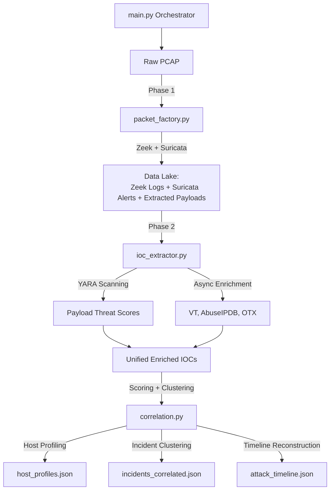

# NetForensicX: Network Forensic Analysis & Attack Reconstruction Framework
 [](https://doi.org/10.5281/zenodo.20047727)


## Project Overview
NetForensicX is an automated Post-Analysis Ingestion Framework designed to process network packet captures (PCAPs), extract Indicators of Compromise (IOCs), and enrich them using multiple Threat Intelligence APIs. It provides a comprehensive forensic platform by implementing host-centric profiling, attack timeline reconstruction, and dynamic severity-based scoring to reduce alert noise.

The pipeline runs sequentially in three main phases:
1. **Phase 1 (`packet_factory.py`)**: Uses Zeek and Suricata to process the raw PCAP file, generating connection logs, DNS/HTTP metadata, security alerts, and carving raw file payloads.
2. **Phase 2 (`ioc_extractor.py`)**: Consumes the Phase 1 output, deduplicates IOCs, performs YARA scanning on carved files, and enriches the indicators asynchronously using VirusTotal, AbuseIPDB, and OTX AlienVault.
3. **Phase 3 (`correlation.py`)**: Correlates the enriched IOCs back to network sessions, implements Host-Centric Profiling, clusters YARA hits with a weighted scoring system, and generates a chronological Attack Timeline.

The entire workflow is managed by a single orchestrator script: `main.py`.

##  Tech Stack
- **Network Analysis:** Zeek, Suricata
- **Malware Detection:** YARA
- **Threat Intelligence APIs:** VirusTotal, AbuseIPDB, OTX AlienVault
- **Caching & Async:** Redis, `aiohttp`, `asyncio`
- **Data Pipeline:** Python 3

##  Architecture


##  Features
- **Automated PCAP Extraction:** Uses Zeek and Suricata to carve logs and file payloads from raw traffic.
- **Forensic Integrity & Chain of Custody:** Cryptographically seals analysis output with a `manifest.json`, tracking operator metadata and input PCAP SHA-256 hashes to adhere to legal defensibility standards (NIST SP 800-86).
- **Dynamic IOC Deduplication & Tagging:** Preserves internal network activity by accurately tagging non-routable/special IPs (`ipaddress` classification) without losing lateral movement context.
- **YARA Scoring Engine:** Clusters raw YARA hits into actionable threat categories (e.g., "C2/Backdoor", "Ransomware") with weighted severity scoring.
- **Host-Centric Profiling:** Tracks internal IP activity to accurately map out "Patient Zero" based on chronological tracking of the earliest malicious event.
- **Attack Timeline & Narrative:** Reconstructs the entire narrative of the attack from Initial Access down to Impact using legally defensible UTC ISO 8601 timestamps, deduplicated for readability.
- **High-Performance API Enrichment:** Asynchronous, rate-limited queries to external Threat Intel platforms backed by a Redis cache.

##  Use Cases
- **Security Operations Center (SOC):** Automates initial triage and reduces alert fatigue by clustering noisy alerts into high-fidelity incidents.
- **Digital Forensics & Incident Response (DFIR):** Rapidly reconstructs attack timelines and traces lateral movement across compromised endpoints.
- **Threat Hunting:** Provides a rich, unified dataset of all extracted file hashes, contacted domains, and IP addresses mapped to intelligence scores.

##  Sample Output
Example event from the generated `attack_timeline.json`:
```json
[
  {
    "timestamp": 11.091171,
    "action": "Malicious Payload Transfer", 
    "source": "192.168.1.4:49188",
    "destination": "192.168.1.5:445",
    "domain": "Unknown Domain",
    "protocol": "smb",
    "score": 90,
    "session_id": "C13ryZ16G7DsaAR3x5",
    "details": ["YARA Cluster [Ransomware/Destructive] (100 pts on 93df9b96)"]
  }
]
```

---

## Architecture & File Structure

### Core Execution
- **`main.py`**: The master wrapper script. Run this file with a `.pcap` file to automatically execute all phases sequentially.
- **`packet_factory.py`**: The Phase 1 engine. Spawns Zeek and Suricata as subprocesses, extracts logs, links UIDs to Flow IDs, and dumps carved files into a `processed/` data lake.
- **`ioc_extractor.py`**: The Phase 2 engine. Orchestrates extraction, cleaning, YARA scanning, and API enrichment.
- **`correlation.py`**: The Phase 3 engine. Calculates session infection scores, builds host profiles, clusters YARA rules dynamically, and builds an attack timeline.

### Pipeline Modules
- **`config.py`**: The central configuration file. Defines dynamically generated output paths, environment variable fallbacks, API keys, rate limiters, and Redis settings.
- **`extraction.py`**: Reads the Zeek and Suricata NDJSON logs. Extracts IPs, domains, hashes, ports, and application protocols. Contains strict validation to prevent IPs masquerading as domains.
- **`cleaning.py`**: Filters out invalid/empty records and internal/private network IP addresses. Performs intelligent deduplication while preserving distinct port connections.
- **`yara_scan.py`**: Scans all payloads carved by Zeek and Suricata against local YARA rules to detect known malware signatures. Implements dynamic YARA clustering and scoring (e.g., mapping raw rules into categories like "C2/Backdoor" or "Ransomware/Destructive").
- **`enrichment_async.py`**: The high-performance asynchronous enrichment engine. Queries VirusTotal, AbuseIPDB, and OTX AlienVault in parallel while respecting provider rate limits.
- **`cache.py`**: A Redis-backed caching layer that stores API responses to drastically reduce duplicate queries across different scans.
- **`output.py`**: Formats and saves the final `unified_iocs.json` and a statistical `run_stats.json`.

---

## Prerequisites & Installation

### 1. System Requirements (Linux/Debian/Ubuntu)
The Phase 1 orchestrator (`packet_factory.py`) relies heavily on native security binaries to process PCAP files. Run the following to install the core system dependencies:

```bash
sudo apt-get update
sudo apt-get install -y zeek suricata redis-server
```

Make sure Redis is running before executing the pipeline:
```bash
sudo systemctl enable redis-server
sudo systemctl start redis-server
```

*(Note on Zeek: It is usually installed in `/opt/zeek/bin/zeek`. Ensure this is accessible or added to your system `$PATH`).*

> **Troubleshooting Zeek Intel Framework Issues:**
> On fresh installations, you may encounter issues loading Zeek's `intel` framework. If Zeek fails to run because of this, you can safely skip the Intel module by commenting out or removing the line `@load frameworks/intel\n` inside `packet_factory.py` where the Zeek script is generated.

### 2. Python Environment Setup
The Phase 2 enrichment engine (`ioc_extractor.py`) requires several Python libraries to handle async API requests, Redis caching, and YARA rule matching. It is highly recommended to use a Python virtual environment to manage these dependencies.

```bash
# Create a new virtual environment
python3 -m venv env

# Activate the virtual environment
source env/bin/activate

# Install the required Python packages
pip install -r requirements.txt
# Alternatively, you can install them manually:
# pip install aiohttp>=3.9.0 redis>=5.0.0 yara-python>=4.5.0
```

### 3. API Keys (Environment Variables)
Phase 2 relies on external APIs to enrich the IOCs. You will need to register for free accounts and export your API keys as environment variables in your terminal before running the script:

```bash
export VT_API_KEY="your_virustotal_api_key"
export ABUSEIPDB_API_KEY="your_abuseipdb_api_key"
export OTX_API_KEY="your_otx_alienvault_api_key"
```

*(Note: If an API key is missing, the pipeline will gracefully skip that specific provider and continue running).*

---

## Execution Guide

### End-to-End Execution (Recommended)
To run the entire pipeline from start to finish on a PCAP file, simply use `main.py`.

```bash
python3 main.py path/to/capture.pcap
```

**What happens under the hood?**
1. **Phase 1** runs, generating parsed logs and extracted payloads inside `processed/capture/`.
2. **Phase 2** automatically targets that specific `processed/capture/` folder.
3. A unique timestamped output folder is generated (e.g., `phase2_output/capture_20260428_123000/`) to prevent overwriting previous runs and to preserve your chain of custody.
4. **Phase 3** consumes the enriched data and outputs host profiles and a chronological attack timeline.

### Running Phases Independently
If you only want to extract the Zeek/Suricata data lake without querying Threat Intel APIs, you can run Phase 1 independently:
```bash
python3 packet_factory.py path/to/capture.pcap
```

If you already ran Phase 1 and just want to re-run the enrichment (Phase 2), you can target the generated processed folder:
```bash
python3 ioc_extractor.py processed/capture/
```

If you want to run Phase 3 (Correlation) on an already processed Phase 2 output:
```bash
python3 correlation.py processed/capture/ phase2_output/capture_20260428_123000/
```

---

## Output Artifacts

After a successful run, navigate to your timestamped output directory (e.g., `phase2_output/Hive_20260428_143000/`). You will find:

- **`manifest.json`**: Cryptographic seal of the entire run, containing the SHA-256 hash of the input PCAP, the exact operator and hostname, and file hashes of all generated output reports and carved payloads.

- **`attack_story.txt`**: A human-readable, auto-generated narrative of the incident. Includes DoS summaries, a host-by-host breakdown of the attack stages (deduplicated by payload hash), and a chronological global attack timeline formatted in UTC ISO 8601.

- **`attack_timeline.json`**: A chronological sequence of the attack. 
  - *Calculations & Logic*: The correlation engine filters all network sessions with an `infection_score > 0`, sorts them by Zeek's `ts` (timestamp), and determines the primary narrative `action` (e.g., "C2 Communication", "Malicious Payload Transfer", "Lateral Movement") based on the highest severity intelligence hits.

- **`host_profiles.json`**: Host-centric infection metrics to identify "Patient Zero" or heavily compromised internal machines.
  - *Calculations & Logic*: Maps internal IP addresses (detected dynamically using `ipaddress` to filter RFC1918/Local ranges) to their associated network activity. It aggregates every malicious session's infection score involving that internal IP (capping DoS scores to prevent inflation) and collects all unique YARA hits, extracted files, connected external IPs, and triggered Suricata alerts.

- **`incidents_correlated.json`**: The core dataset for high and medium severity attack chains.
  - *Calculations & Logic*: Calculates a base `severity` score for every Zeek network session. Scoring weights:
    - **YARA Hits**: Dynamic scoring based on rule clusters (e.g., Ransomware=100, C2=90, Exploit=70).
    - **Volumetric Anomalies**: +80 pts for exceeding DOS/Port Scan thresholds.
    - **VT Malicious IPs/Domains**: +80 pts for >= 5 engine detections.
    - **Suricata Alerts**: +50 pts.
    Sessions scoring >= 80 are marked `HIGH` severity, >= 40 are `MEDIUM`.

- **`unified_iocs.json`**: The canonical dataset containing every extracted indicator (IP, domain, hash), associated ports, YARA clusters, Suricata alerts, and the full Threat Intel enrichment payload (e.g., VirusTotal scores, AbuseIPDB confidence ratings).

- **`scanned_iocs_by_api.json`**: An audit log showing exactly which API endpoints were triggered for which IOC, providing chain-of-custody tracking for external queries.

- **`run_stats.json`**: Statistical counters representing the health of the pipeline (cache hits, API errors, deduplication rates, `dropped_special_ips` count, forensic runtime integrity parameters).

- **`pipeline.log`**: A debug trace of the pipeline execution.
