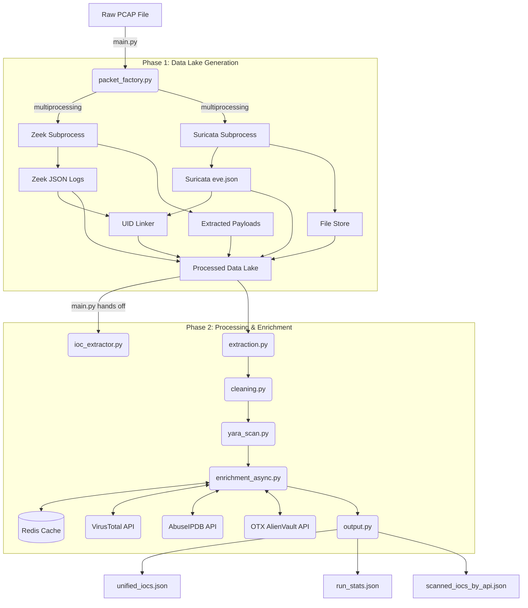

# NetForensicX: System Architecture

NetForensicX is a modular, high-performance pipeline designed to ingest raw network traffic (PCAP), extract Indicators of Compromise (IOCs), and enrich them via external Threat Intelligence platforms. 

The architecture is split into two primary phases: **Extraction (Phase 1)** and **Processing & Enrichment (Phase 2)**.

---

## 🏗️ High-Level Data Flow

---

## 🔍 Module Breakdown

### 1. Master Wrapper (`main.py`)
Provides a single entry point for the user. It sequentially triggers `packet_factory.py` (Phase 1) and then `ioc_extractor.py` (Phase 2), passing the generated Data Lake path between them.

### 2. Phase 1: `packet_factory.py`
The heavy-lifting packet ingestion engine.
- **Multiprocessing**: Spawns `zeek` and `suricata` in parallel to utilize multiple CPU cores.
- **Zeek Configuration**: Injects a dynamic `local.zeek` to force JSON logging and carve all files from the traffic.
- **Suricata Configuration**: Dynamically detects the installed version to generate a compatible `suricata.yaml` rule configuration.
- **UID Linker**: Reads `conn.json` and `eve.json` to map Zeek connection UIDs directly to Suricata Flow IDs based on the network 5-tuple (src IP, src Port, dst IP, dst Port, Protocol).

### 3. Phase 2: `ioc_extractor.py`
The orchestration layer for data processing, invoking the following sub-modules sequentially:

#### A. Data Extraction (`extraction.py`)
- Reads the NDJSON logs from Phase 1.
- Identifies and extracts IP addresses, domain names, file hashes, and Suricata alerts.
- **Intelligent Parsing**: Resolves edge cases where IPs and Ports are concatenated inside HTTP Host headers, safely separating IPs from Domains and extracting native port/protocol details.

#### B. Cleaning & Deduplication (`cleaning.py`)
- Automatically drops local and RFC 1918 private IP addresses.
- Deduplicates IOCs based on a unique hash of the `IP|Domain|FileHash|Port`. This guarantees that if a single IP is contacted over multiple distinct ports, each connection is preserved for analysis.

#### C. Local YARA Scanning (`yara_scan.py`)
- Compiles YARA rules located in the `yara_rules/` directory at startup.
- Automatically hashes and scans all carved payloads from Phase 1 against the compiled rules, attaching the matched signature to the associated file hash IOC.

#### D. Asynchronous API Enrichment (`enrichment_async.py`)
- Utilizes `asyncio` and `aiohttp` to perform highly concurrent REST API requests.
- Implements strict **Token Bucket** rate-limiting dynamically configured for each API provider (VirusTotal, AbuseIPDB, OTX).
- Avoids repetitive queries by leveraging `cache.py` (a Redis backend).
- Generates `scanned_iocs_by_api.json` as an audit trail of which specific indicators were passed to which external platforms.

#### E. Output Aggregation (`output.py`)
- Takes the enriched IOCs and writes them to a final, timestamped isolation directory (e.g., `phase2_output/capture_20260428_120000/`).
- Computes statistics on total deduplications, API errors, cache hits, and high-confidence malicious flags.
